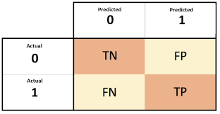

Now we know what Classification Trees are let's see how to train and make predictions. We will use the wine dataset from `sklearn`
```{python}
import pandas as pd
from sklearn.datasets import load_wine
import seaborn as sns
import matplotlib.pyplot as plt
from sklearn.model_selection import train_test_split
from sklearn.tree import DecisionTreeClassifier
from sklearn.metrics import accuracy_score
from sklearn.metrics import confusion_matrix
from sklearn import tree
from sklearn.metrics import accuracy_score, precision_score, recall_score, f1_score
from sklearn.metrics import classification_report

# Load wine data in numpy array
X, y = load_wine(return_X_y = True)
X.shape # 178 instances

# Check distribution our target
sns.displot(y)

# Split into training set and test set
X_train, X_test, y_train, y_test = train_test_split(X, y, test_size = .20, random_state=0)
X_train.shape # 142 instances

# Define our model
dt_classifier = DecisionTreeClassifier(max_depth = 2) 

# Train
dt_classifier.fit(X_train, y_train) 
```

Note the `max_depth` hyperparameter from `DecisionTreeClassifier` was set to 2. We used 2 arbitrarily but we could have used **cross validation** to select the best depth.

With our trained model we can use `predict` to predict the classes:
```{python}
# Predict
y_train_predict = dt_classifier.predict(X_train) 
```

Let's visualize our tree:
```{python}
wine = load_wine()

plt.figure()
tree.plot_tree(
  dt_classifier,
  feature_names = wine.feature_names,
  filled = True, 
  fontsize=6, 
  rounded = True
  )
plt.show()
```

* `color_intensity <= 3.82`: threshold that separates into different nodes
* `gini`: Gini Impurity
* `samples`: number of observations for each node
* `value`: number of classifications that fall into each group

We trained our Classification Tree and got our predictions. The last step is to evaluate our model but how? We use a Confusion Matrix: 


Let's assume we have two classes and let 0 be the negative class and 1 the positive class. Each row is an actual class and each column is the predicted class. Depending on how the classifications were made we divide them into four different categories:

* $TN = \frac{correctly~classified~as~negative}{negative~class}$
* $FP = \frac{incorrectly~classified~as~positive}{negative~class}$
* $FN = \frac{incorrectly~classified~as~negative}{positive~class}$
* $TP = \frac{correctly~classified~as~positive}{positive~class}$

Next, we discuss three different ways from a confusion matrix to see how good your classification tree is:

* $Accuracy = \frac{TN+TP}{TN+FP+FN+TP}$

* $Precision = \frac{TP}{FP+TP}$

* $Recall = \frac{TN}{FN+TP}$

Based on the confusion matrix it seems natural to use Accuracy but consider the case where we have 9 negative and 1 positive observations and let's say there is a silly model that always classifies as negative. Then the accuracy is 90% (TN: 9, FP: 0, FN: 1, TP: 0 => $\frac{9+1}{9+0+1+0}$). Hence accuracy is not always a good metric especially when the classes are imbalanced. This is why we need a better metric like **Precision**. As you can see from the formula, the denominator takes all predicted cases both false positive and true positive. Out of these we want to find only the true positives, hence Precision is the accuracy of the positive predictions. 

However Precision is also not perfect. If we only have one positive prediction and if that is true positive, then we have 100% Precision ($\frac{1}{1+0}$). This is why we report **Recall** aka **Sensitivity** or **True Positive Rate** along with Precision. Recall only differs by the denominator: the number of true positives out of all the **actual** positive instances. 

This is the confusion matrix for our wine data:
```{python}
confusion_matrix(y_train, y_train_predict)
```
Note that this matrix is 3 by 3 as we have three classes instead of two. We call this a multi-class classification. We apply the same logic as we did for 2 by 2 but we just need to break each of the three classes into positive or negative, respectively. If we assume `class0` is positive, then 

* TP = classified as `class0` when the actual is `class0` = 45
* FP = classified as `class0` when the actual is not = 2 + 0 = 2
* TN = classified as not `class0` (`class1` or `class2`) when the actual is not = 46 + 7 + 0 + 42 = 95
* FN = classified as not `class0` when the actual is `class0` = 0 + 0 = 0

* Precision = $\frac{45}{45+2}=0.96$
* Recall = $\frac{45}{45+0}=1.00$

```{python}
## Evaluation
# Accuracy
accuracy_score(y_train, y_train_predict) 

sns.heatmap(confusion_matrix(y_train, y_train_predict), annot = True)
plt.show()

print(classification_report(y_train, y_train_predict, target_names=['Class 0', 'Class 1', 'Class 2']))

```

`macro avg` is calculated as the unweighted mean of f1-scores from each class : $\frac{0.98+0.91+0.92}{3}=0.94$

`weighted avg` is calculated as the weighted mean of the number of samples for each class

Now that we we know Precision and Recall, let's dive in a little bit deeper. Because there is a trade-off between Precision and Recall, generally we can't have both perfect metrics. However there are cases where we care mostly just about Precision or Recall and it is OK to have the other showing a low value. 

For instance, let's say there is a COVID-19 testing kit that tells a potential patient whether or not they have COVID. In this context, a false positive means even though the patient is COVID negative, the kit says positive. On the other hand, a false negative means even though the patient is COVID positive, the kit says negative. Between false positive and false negative which one do you think is more critical? It would be false negative as that patient carries the real COVID but will feel comfortable to hang out simply because the kit says the opposite/healthy which will result in spreading COVID. On the flip side, it is relatively OK to have higher false positive because the patient will be cautious and being cautious will not harm anyone. Hence, we need to have a high recall but it is OK to have low precision. 

Another example would be to test a an AI model tells if a person is guilty or not. Assuming positive is guilty and negative not guilty, false positive means even though the person is innocent, the classifier says guilty. False negative means even though the person is guilty, the classifier says innocent. Of these two, let's assume that the stakeholders considered false positive being the worst case because no innocent people should be classified as guilty. Hence, we need to have high precision but it is relatively OK  to have low recall. 
