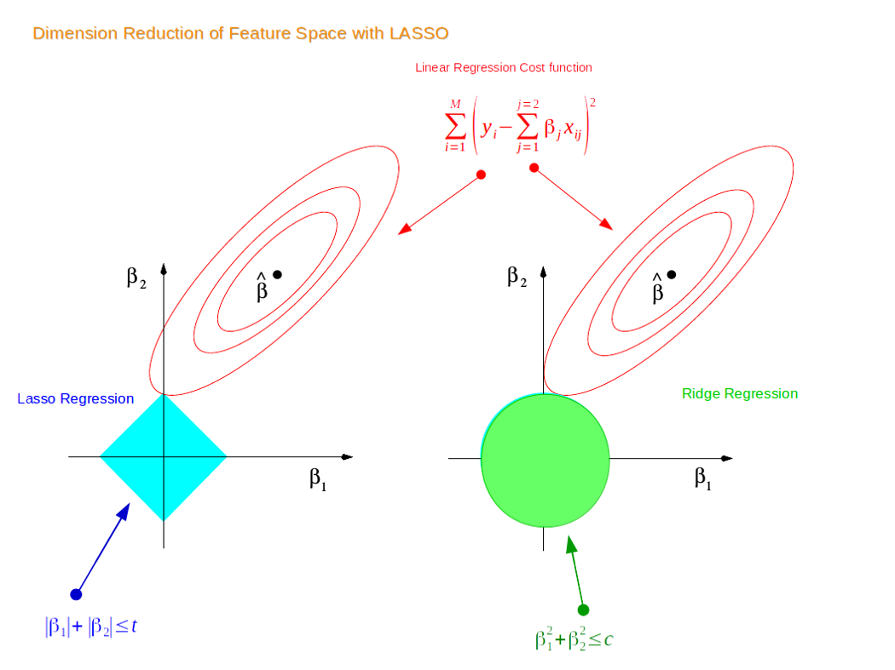

<br>

First, we will discuss Ridge Regression. But beofre that let's first go through Linear Regression. Recall that the cost function for Linear Regression is:

$$min\sum_{i=1}^{n} (\hat y - y)^2$$ 

The loss function for Ridge Regression is: 
$$ min \sum_{i=1}^{n} (\hat{y} - y)^2 + \lambda \sum_{i=1}^{m} w_i $$ 
The added regularization term in Ridge Regression is called the $l2$-norm which acts as a penalty to Linear Regression. In other words, Ridge Regression introduces a small bias. Why? In return for the bias, we can achieve reduced variance. If the model has a high variance, it'll probably not generalize well for unseen future data points.

This is why Ridge Regression is a **regularized** linear model. 

Let's see what this all means in action:

```{python}
## Python 3.9.6
## Import packages
import pandas as pd
from sklearn.datasets import make_regression
from sklearn.datasets import make_regression
from matplotlib import pyplot as plt
from sklearn.linear_model import Ridge, Lasso, ElasticNet
```

```{python}
## Generate data with one coefficient fitted from a linear regression model
X, y, coef = make_regression(
    n_samples=20,
    n_features=1,
    n_informative=1, # number of useful features
    n_targets=1,
    noise=20,
    coef=True,
    random_state=1
)

coef
```

```{python}
lambda_value = 1 
rr = Ridge(lambda_value) 
rr.fit(X, y)

w = rr.coef_
w

plt.scatter(X, y)
plt.plot(X, w*X, c='red')
```

As you can see, Ridge Regression (red line) is very close to Linear Regression when lambda_value = 1

<br>

If we increase `lambda_value` to 10:
```{python}
lambda_value = 10 
rr = Ridge(lambda_value) 
rr.fit(X, y)

w = rr.coef_
w

plt.scatter(X, y)
plt.plot(X, w*X, c='red')
```

Now, we see a slightly worse fit (higher bias) but we expect to have a lower variance for new data points.

<br>

Next, we have Lasso Regression. Like Ridge Regression, it is another regularized linear model to prevent the model from overfitting. The only difference is in the cost function:

$$ min \sum_{i=1}^{n} (\hat{y} - y)^2 + \lambda \sum_{i=1}^{m} |w_i| $$ The new regularization term is called the $l1$-norm. The difference becomes clear by checking visually:



The first point where the elliptical contours touch the region of constraints is how the coefficients from both Ridge and Lasso Regression are determined. Unlike the circular shape of Ridge, Lasso has corners. Hence, if the contour hits the corners, the feature(s) will disappear. Thus, Lasso can perform variable selection, hence the name **Least Absolute Shrinkage and Selection Operator**.

If we fit using the same `X` and `y` data:

```{python}
las = Lasso(lambda_value)
las.fit(X, y)
w = las.coef_
w
```

```{python}
# Plot
plt.scatter(X, y)
plt.plot(X, w*X, c='red')
```

Lasso returns a fairly close fit to Ridge Regression 


Lastly, Elastic Net is a middle ground between Ridge Regression and Lasso Regression. The regularization term is a mix of both where $r$ controls the mix ratio.

$$ min \sum_{i=1}^{n} (\hat{y} - y)^2 + r\lambda \sum_{i=1}^{m}|w_i| + \frac{(1-r)}2 \lambda \sum_{i=1}^{m} w_i^2 $$

```{python}
## Elastic Net
# Fit
enet = ElasticNet(alpha=lambda_value, l1_ratio=.5)
enet.fit(X, y)
w = enet.coef_
w
```

```{python}
# Plot
plt.scatter(X, y)
plt.plot(X, w*X, c='red')
```

So you might be wondering which one to use including Linear Regression without any regularization. Rule of thumb is to avoid using plain Linear Regression. One can start with Ridge but if you think there are features that are not important, you should use Lasso or Elastic Net. Normally, Elastic Net is preferred over Lasso since Lasso can behave weird when the number of features is greater than the number of instances or when some features have a strong correlation.